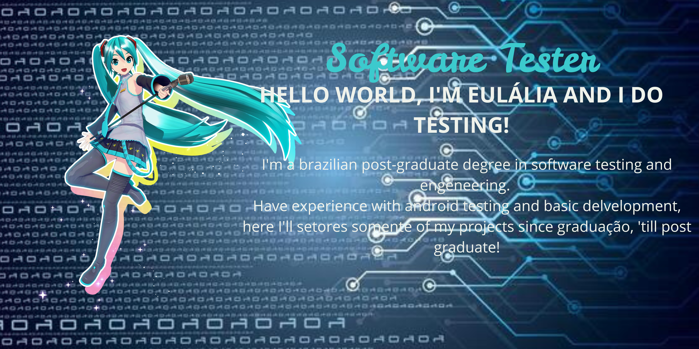

  
Welcome to my GitHub Profile!

  
 Visitor Count! 

  

    
  

  

  <h1 align="center">
      
  </h1>
  <h3>
    I'm a brazilian software test engineer, also developer, did a post-graduation at the CIn-Motorola project at UFPE (Pernambuco's Federal University) Informatics Center.  
    Most of the projects in here are development projects, but my practical experience involves mostly Android testing!
  </h3>
  <ul>
    <li>👩‍🎓 I'm graduated as a System Developer and Analystic and post graduated as a Software Tester and Engineer <a href=https://www.linkedin.com/company/cinmotorola/>@CIn-Motorola</a></li>
    <li>📘 Currently studying <a href=https://developer.android.com/kotlin?hl=pt-br>Kotlin Android Development</a></li>
  </ul>

  

<h2>🛠️ Languages and Tools</h2>
 

    
  

